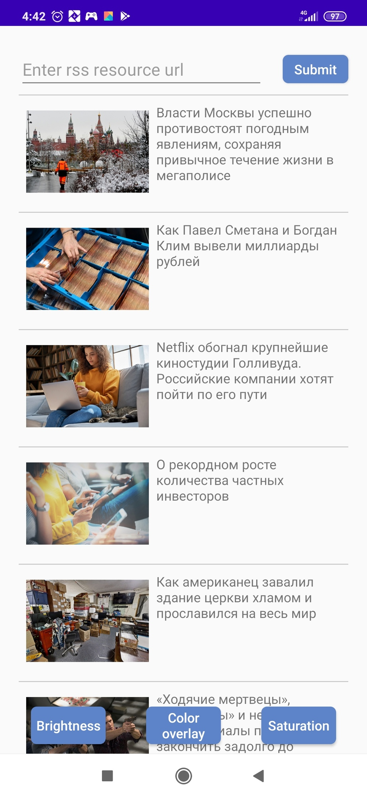
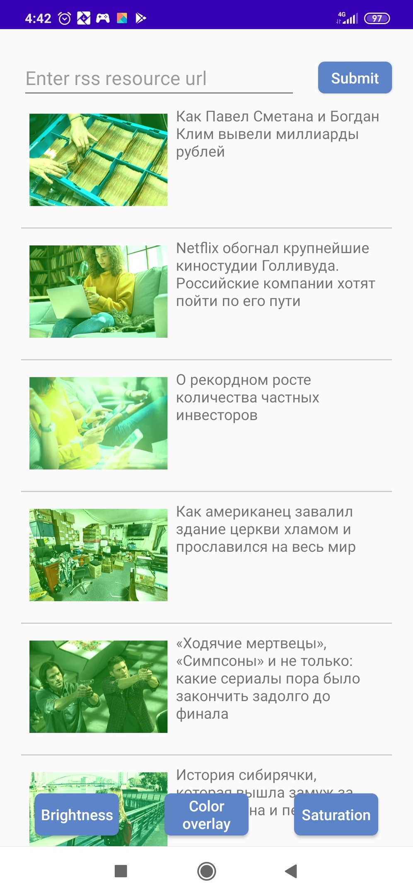
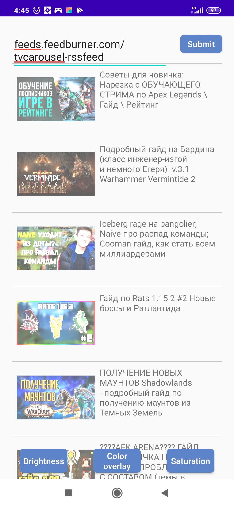

Lenta without filters       |  Lenta with color overlay |  Random resource with brightness
:-------------------------:|:-------------------------:|:-------------------------:
     |    | 

## Dependencies
* [rxJava](https://github.com/ReactiveX/RxJava) - library for convenient work with asynchronous tasks
* [dagger2](https://github.com/google/dagger) - compile-time dependency injection framework
* [glide](https://github.com/bumptech/glide) - image loading
* [moxy](https://github.com/moxy-community/Moxy) - MVP framework
* [photoFiltersSDK](https://github.com/Zomato/AndroidPhotoFilters) - image filters library
* [rss parser](https://github.com/prof18/RSS-Parser) - RSS parser with using [okHttpClient](https://square.github.io/okhttp/4.x/okhttp/okhttp3/-ok-http-client/) for retrieving data